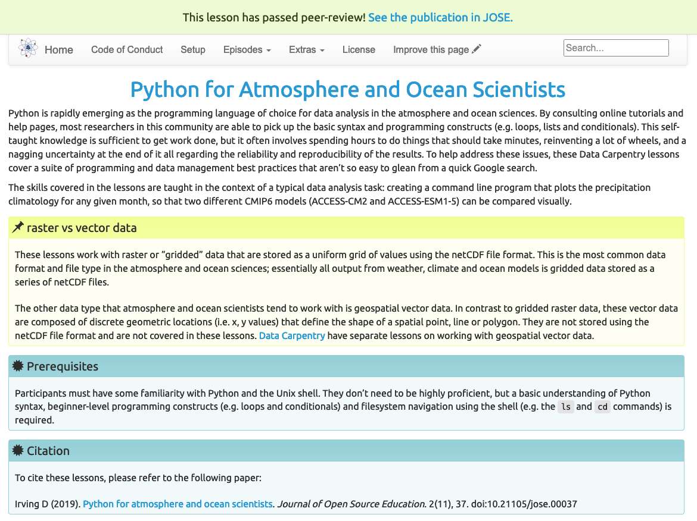

  

    

      

        
      

      

        <h2 class="display-5 fw-bold lh-1 mb-3">About The Carpentries Lab</h2>
        
The Carpentries Lab is a place for high-quality, stable lessons. It provides a space and processes for open peer review of lessons, and hosts a collection of reviewed lessons for members of <a href="https://carpentries.org">The Carpentries</a> community to teach in their own workshops.

      

    

  

  

    <h2 class="display-5 fw-bold lh-1 mb-3">How to get involved</h2>
    

      

        <h2>Submit your lesson</h2>
        
Lessons are accepted to The Carpentries Lab after open peer review by members of The Carpentries community.

        <a href="https://github.com/carpentries-lab/reviews/" class="btn btn-primary">
            Request a review
          </a>
      

      

        <h2>Review a lesson</h2>
        
Help authors improve their lesson by volunteering as a reviewer. Fill in the form to register as a Lesson Reviewer.

        <a href="https://forms.gle/P8oKF6QMejDmUQdu6" class="btn btn-primary">
            Volunteer
          </a>
      

    

  





  <h2 class="display-5 fw-bold lh-1 mb-3">Supporters</h2>
  

    The Carpentries Lab project is generously supported by <a href="https://chanzuckerberg.com/">The Chan Zuckerberg Initiative</a>, <a href="https://www.moore.org/">The Gordon and Betty Moore Foundation</a>, and <a href="https://sloan.org/">The Alfred P. Sloan Foundation</a>.
  

